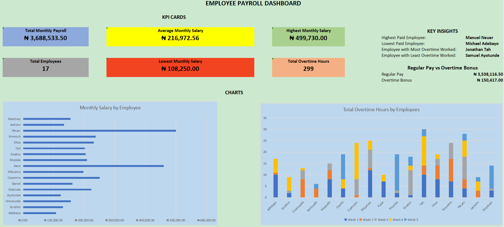
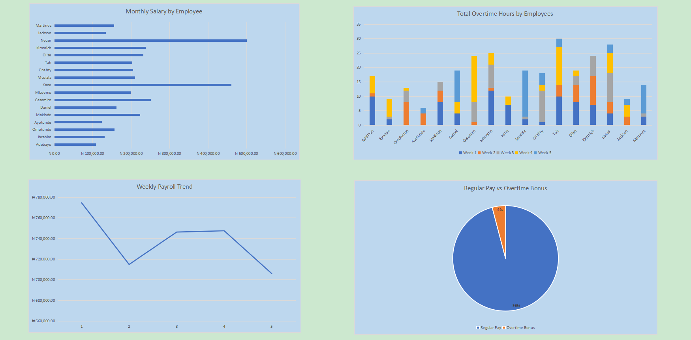
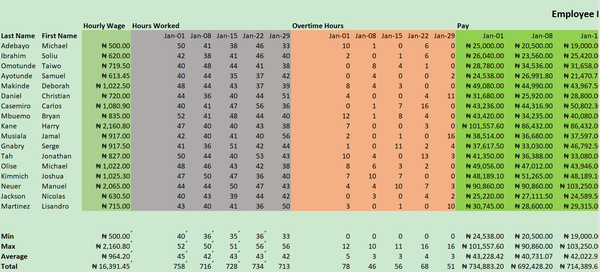
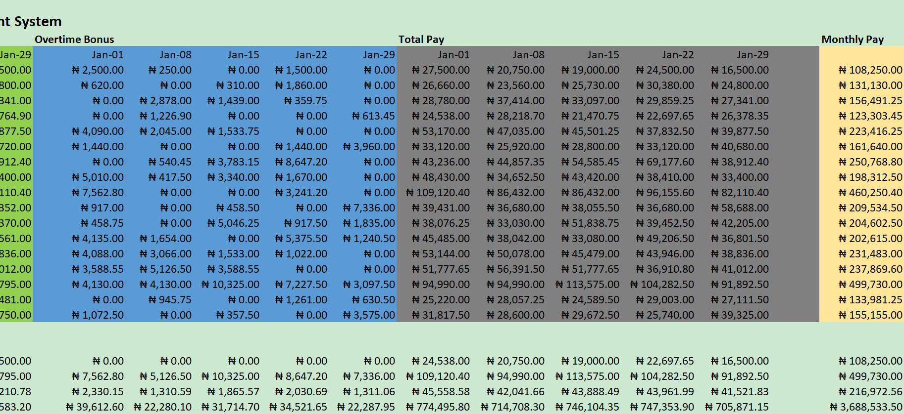

# employee-payroll-management-system-excel
## 📖 Overview

The **Employee Payroll Management System** is a Microsoft Excel-based payroll solution designed to automate employee salary calculations and present payroll insights through an interactive dashboard.

This project demonstrates the use of Excel formulas, data analysis techniques, and dashboard design to transform payroll data into meaningful business insights.

---

## 🎯 Project Objectives

- Automate employee payroll calculations.
- Compute overtime hours and overtime bonuses.
- Calculate weekly and monthly salaries.
- Present payroll information using an executive dashboard.
- Demonstrate practical Microsoft Excel skills for business reporting.

---

## 📊 Dashboard Preview

### Payroll Dashboard

 

### Payroll Worksheet

---

## ✨ Features

- Automated payroll calculation
- Weekly salary computation
- Monthly salary computation
- Overtime hours calculation
- Overtime bonus calculation
- Payroll summary statistics
- Executive dashboard
- Payroll trend visualization
- Employee salary comparison
- Payroll composition analysis
- Key payroll insights

---

## 📈 Dashboard KPIs

The dashboard provides:

- Total Employees
- Total Monthly Payroll
- Average Monthly Salary
- Highest Monthly Salary
- Lowest Monthly Salary
- Total Overtime Hours

---

## 📉 Visualizations

The dashboard includes:

- 📊 Monthly Salary by Employee
- 📈 Weekly Payroll Trend
- 📊 Total Overtime Hours by Employee
- 🥧 Regular Pay vs Overtime Bonus

---

## 🛠 Microsoft Excel Skills Demonstrated

- IF Function
- SUM
- AVERAGE
- MIN
- MAX
- Relative & Absolute Cell Referencing
- Conditional Formatting
- Charts
- Dashboard Design
- Data Visualization
- Financial Calculations

---

## 🚀 How to Use

1. Download the Excel workbook.
2. Open using Microsoft Excel (recommended).
3. Navigate to the **Payroll** worksheet to view payroll calculations.
4. Open the **Dashboard** worksheet to explore payroll insights.

---

## 💡 Business Insights

This dashboard helps answer questions such as:

- What is the total monthly payroll?
- Who is the highest-paid employee?
- Who worked the most overtime?
- How does payroll change week by week?
- How much of payroll is spent on overtime?

---

## 📚 Tools Used

- Microsoft Excel
- Excel Charts
- Excel Dashboard
- Data Analysis
- Spreadsheet Automation

---

## 👨‍💻 Author

**Okechukwu Charles**

B.Tech. Industrial Mathematics  
Aspiring Data Analyst | Data Science Enthusiast

- GitHub: https://github.com/Okechukwu4Charles 
- LinkedIn: https://www.linkedin.com/in/okechukwu-charles

---

## ⭐ If you found this project interesting

Feel free to star the repository or connect with me on LinkedIn.
